# Node.js

菜鸟教程：https://www.runoob.com/nodejs/nodejs-tutorial.html

Node.js 的核心架构围绕**异步 I/O**、**事件驱动**和**轻量高效**三大特性构建。要掌握其精髓，需重点关注以下五大核心模块和设计思想：

---

## 一、核心模块

###  1. 事件循环（Event Loop）—— Node.js 的“心脏”

- **作用**：单线程处理高并发的核心机制，协调异步任务调度。
- **关键原理**：
  - **非阻塞 I/O**：文件读写、网络请求等操作不阻塞主线程，通过回调通知结果。
  - **事件队列**：异步任务完成后，回调函数进入队列，由事件循环按顺序执行。
- **典型代码**：
  ```javascript
  setTimeout(() => console.log('异步任务'), 0); 
  console.log('同步任务');
  // 输出顺序：同步任务 -> 异步任务
  ```

> ⚠️ **理解重点**：为什么 `fs.readFile` 不卡住程序？—— I/O 操作交给系统内核，主线程继续执行其他代码。

---

###  2. 模块系统（CommonJS）—— 代码组织基石
- **核心规则**：
  - `require()`：导入模块（如 `const fs = require('fs')`）。
  - `module.exports`：导出功能（替代 ES6 的 `export`）。
- **加载机制**：
  - 模块首次加载后缓存，避免重复执行。
  - 路径解析规则（`node_modules` 逐层向上查找）。

---

###  3. 核心 API 模块 —— 开发必备工具包
| **模块**     | **核心功能**                     | **高频 API**                                |
| ------------ | -------------------------------- | ------------------------------------------- |
| **`fs`**     | 文件系统操作                     | `readFile`, `writeFile`, `createReadStream` |
| **`http`**   | 构建 Web 服务器/客户端           | `createServer()`, `request()`               |
| **`path`**   | 跨平台路径处理                   | `join()`, `resolve()`, `dirname`            |
| **`stream`** | 高效处理大文件（管道式数据处理） | `pipe()`, `on('data')`                      |
| **`events`** | 自定义事件监听与触发             | `EventEmitter`, `on()`, `emit()`            |

**示例：流处理优化性能**
```javascript
// 复制大文件（避免内存溢出）
const fs = require('fs');
fs.createReadStream('input.mp4')
  .pipe(fs.createWriteStream('output.mp4'));
```

---

### 4.包管理与生态（npm）—— 扩展能力的引擎

- **npm 核心操作**：
  - `npm install`：安装依赖（`-S` 生产依赖，`-D` 开发依赖）。
  - `package.json`：定义项目元数据、依赖和脚本命令。
- **生态力量**：
  - 超 200 万个模块（如 Express、Socket.IO、Axios）。
  - 框架支持：Express（Web 服务）、Koa（高并发中间件）、NestJS（企业级）。

---

### 5. 异步编程模型 —— 规避“回调地狱”的进化
1. **回调函数（Callback）**：基础异步模式（易嵌套过深）。
   ```javascript
   fs.readFile('file.txt', (err, data) => {
     if (err) throw err;
     console.log(data);
   });
   ```
2. **Promise**：链式调用优化嵌套。
   ```javascript
   fs.promises.readFile('file.txt')
     .then(data => console.log(data))
     .catch(err => console.error(err));
   ```
3. **Async/Await（推荐）**：以同步写法写异步代码。
   ```javascript
   async function readData() {
     try {
       const data = await fs.promises.readFile('file.txt');
       console.log(data);
     } catch (err) {
       console.error(err);
     }
   }
   ```

---

### 6. 扩展知识（高阶必备）
| **领域**     | **关键技术**                                     |
| ------------ | ------------------------------------------------ |
| **进程管理** | `child_process`（多进程）、`cluster`（负载均衡） |
| **性能优化** | 内存泄漏排查、事件循环延迟监控                   |
| **安全实践** | 输入验证、依赖漏洞扫描（`npm audit`）            |
| **部署运维** | PM2 进程守护、Docker 容器化                      |

---

### 7. 核心思想总结
1. **事件驱动**：一切 I/O 皆事件（用 `EventEmitter` 理解底层）。
2. **非阻塞优先**：避免 Sync 后缀的同步 API（如 `fs.readFileSync` 会卡住进程）。
3. **流式处理**：大文件/实时数据用 Stream 分块处理。
4. **生态杠杆**：用 npm 快速集成轮子（勿重复造轮子）。

> 🔍 **学习建议**：从 `http` + `fs` 模块写一个静态文件服务器开始，逐步加入 Express 路由和数据库（如 MongoDB），90% 的 Node.js 应用由这些核心构成。


## 二、文件系统

Node.js 的文件系统（fs）模块是与文件系统交互的核心工具，提供了文件读写、目录操作、权限管理等强大功能。下面我将从多个维度详细解析这个模块：

### 1. 模块基础与引入方式

#### 1.1 模块引入
```javascript
// 标准引入方式
const fs = require('fs');

// Promise API 引入 (Node.js v10+)
const fsPromises = require('fs').promises;
```

#### 1.2 两种操作模式

- **异步操作**：非阻塞I/O，使用回调函数
- **同步操作**：阻塞式，方法名以`Sync`结尾

### 2. 核心文件操作

#### 2.1 文件读写操作

##### 异步读写
```javascript
// 读取文件
fs.readFile('example.txt', 'utf8', (err, data) => {
  if (err) throw err;
  console.log('文件内容:', data);
});

// 写入文件
fs.writeFile('output.txt', '新内容', 'utf8', (err) => {
  if (err) throw err;
  console.log('文件写入成功');
});
```

##### 同步读写
```javascript
try {
  const data = fs.readFileSync('example.txt', 'utf8');
  console.log('同步读取:', data);
  
  fs.writeFileSync('output.txt', '同步写入内容');
} catch (err) {
  console.error('操作失败:', err);
}
```

##### Promise API
```javascript
async function fileOperations() {
  try {
    const data = await fsPromises.readFile('example.txt', 'utf8');
    await fsPromises.writeFile('output.txt', `更新内容: ${new Date()}`);
    console.log('文件操作成功');
  } catch (err) {
    console.error('Promise操作失败:', err);
  }
}
```

#### 2. 2 文件追加与修改

```javascript
// 追加内容
fs.appendFile('log.txt', `${new Date()} - 日志条目\n`, (err) => {
  if (err) throw err;
});

// 修改文件权限
fs.chmod('script.sh', 0o755, (err) => {
  if (err) throw err;
});
```

### 3. 目录操作

#### 3.1 目录创建与读取
```javascript
// 创建目录
fs.mkdir('new-directory', { recursive: true }, (err) => {
  if (err) throw err;
});

// 读取目录内容
fs.readdir('./', (err, files) => {
  if (err) throw err;
  console.log('当前目录内容:', files);
});
```

#### 3.2 目录删除
```javascript
// 删除空目录
fs.rmdir('empty-directory', (err) => {
  if (err) throw err;
});

// 递归删除非空目录 (Node.js v14+)
fs.rm('non-empty-directory', { recursive: true, force: true }, (err) => {
  if (err) throw err;
});
```

### 4. 文件元数据与状态

#### 4.1 获取文件信息
```javascript
fs.stat('example.txt', (err, stats) => {
  if (err) throw err;
  
  console.log('文件信息:', {
    size: stats.size,          // 文件大小(字节)
    isFile: stats.isFile(),     // 是否是文件
    isDir: stats.isDirectory(), // 是否是目录
    createdAt: stats.birthtime, // 创建时间
    modified: stats.mtime       // 修改时间
  });
});
```

#### 4.2 检查文件存在性
```javascript
fs.access('config.json', fs.constants.F_OK | fs.constants.R_OK, (err) => {
  if (err) {
    console.log('文件不存在或不可读');
  } else {
    console.log('文件存在且可读');
  }
});
```

### 5. 流式文件处理（处理大文件）

#### 5.1 读取流
```javascript
const readStream = fs.createReadStream('largefile.mp4', { highWaterMark: 16 * 1024 });

readStream.on('data', (chunk) => {
  console.log(`接收到 ${chunk.length} 字节数据`);
});

readStream.on('end', () => {
  console.log('文件读取完成');
});

readStream.on('error', (err) => {
  console.error('读取错误:', err);
});
```

#### 5.2 写入流
```javascript
const writeStream = fs.createWriteStream('output.mp4');

writeStream.on('finish', () => {
  console.log('写入完成');
});

writeStream.on('error', (err) => {
  console.error('写入错误:', err);
});
```

#### 5.3 管道操作
```javascript
// 文件复制
fs.createReadStream('source.mp4')
  .pipe(fs.createWriteStream('copy.mp4'));

// 压缩后写入
const zlib = require('zlib');
fs.createReadStream('source.log')
  .pipe(zlib.createGzip())
  .pipe(fs.createWriteStream('source.log.gz'));
```

### 6. 高级功能

#### 6.1 文件监视
```javascript
// 监视文件变化
const watcher = fs.watch('config.json', (eventType, filename) => {
  console.log(`事件类型: ${eventType}, 文件: ${filename}`);
  
  // 10秒后停止监视
  setTimeout(() => {
    watcher.close();
    console.log('停止监视');
  }, 10000);
});
```

#### 6.2 文件描述符操作
```javascript
fs.open('data.bin', 'r+', (err, fd) => {
  if (err) throw err;
  
  const buffer = Buffer.alloc(1024);
  
  // 从指定位置读取
  fs.read(fd, buffer, 0, buffer.length, 0, (err, bytesRead) => {
    if (err) throw err;
    
    // 写入到新位置
    fs.write(fd, buffer, 0, bytesRead, 1024, (err) => {
      if (err) throw err;
      fs.close(fd, () => console.log('操作完成'));
    });
  });
});
```

### 7. 最佳实践与注意事项

1. **异步优先**：始终优先使用异步方法，避免阻塞事件循环
2. **错误处理**：所有异步操作都必须处理错误
3. **路径安全**：使用`path`模块处理路径，避免跨平台问题
4. **流式处理**：大文件操作务必使用流
5. **权限检查**：操作前检查文件权限，避免运行时错误
6. **资源清理**：及时关闭文件描述符和监视器
7. **Promise封装**：在async/await环境中使用Promise API

```javascript
// 安全路径示例
const path = require('path');

const safePath = path.join(__dirname, 'data', 'files', 'document.txt');
fs.readFile(safePath, 'utf8', (err, data) => {
  // ...
});
```

### 8. 常用常量与标志

| 常量                    | 描述         | 常用场景   |
| ----------------------- | ------------ | ---------- |
| `fs.constants.F_OK`     | 文件是否存在 | 存在性检查 |
| `fs.constants.R_OK`     | 文件是否可读 | 权限检查   |
| `fs.constants.W_OK`     | 文件是否可写 | 权限检查   |
| `fs.constants.O_RDONLY` | 只读打开     | 打开文件   |
| `fs.constants.O_WRONLY` | 只写打开     | 打开文件   |
| `fs.constants.O_CREAT`  | 不存在则创建 | 文件创建   |

### 9. 实际应用场景

1. **配置文件管理**：读写JSON/XML配置文件
2. **日志系统**：实时追加日志条目
3. **文件上传**：流式处理大文件上传
4. **数据导入/导出**：处理CSV、Excel等数据文件
5. **静态文件服务**：创建HTTP静态文件服务器
6. **数据库备份**：定时备份数据库文件

### 10. 性能优化技巧

1. **缓冲区大小**：调整`highWaterMark`优化流性能
2. **批量操作**：使用`writev`进行批量写入
3. **零拷贝**：使用`sendfile`系统调用传输文件
4. **内存管理**：避免大文件完整加载到内存
5. **并发控制**：限制同时打开的文件描述符数量

Node.js的fs模块是服务器端开发的核心工具之一，掌握其各种特性和最佳实践，能够帮助你构建高效可靠的文件处理系统。


## 三、Path 

Node.js 的 `path` 模块是处理文件路径的核心工具，它提供了一系列跨平台的方法来操作文件路径。在 Windows 和 POSIX 系统（Linux/macOS）中，路径格式有显著差异，`path` 模块能自动处理这些差异，确保代码在不同操作系统上正常运行。

### 1. 核心功能概览

| 方法类别         | 主要方法                                              | 功能描述                 |
| ---------------- | ----------------------------------------------------- | ------------------------ |
| **路径拼接**     | `path.join()`                                         | 智能拼接路径片段         |
| **路径解析**     | `path.resolve()`                                      | 解析绝对路径             |
| **路径规范化**   | `path.normalize()`                                    | 简化路径格式             |
| **路径解析**     | `path.parse()`                                        | 分解路径为对象           |
| **路径格式化**   | `path.format()`                                       | 对象转为路径字符串       |
| **路径信息提取** | `path.basename()`, `path.dirname()`, `path.extname()` | 获取文件名/目录名/扩展名 |
| **平台处理**     | `path.sep`, `path.delimiter`                          | 获取平台分隔符           |

### 2. 核心方法详解

#### 2.1 路径拼接 - `path.join()`
智能拼接多个路径片段，自动处理分隔符

```javascript
const path = require('path');

// 跨平台安全拼接
console.log(path.join('/user', 'documents', 'files/notes.txt'));
// POSIX: /user/documents/files/notes.txt
// Windows: \user\documents\files\notes.txt

// 处理相对路径
console.log(path.join('src', '../images', './logo.png'));
// 输出: images/logo.png (所有平台)
```

#### 2.2 绝对路径解析 - `path.resolve()`
从右向左解析，直到构造出绝对路径

```javascript
// 示例目录: /home/user/project
console.log(path.resolve('src', 'app.js'));
// 输出: /home/user/project/src/app.js

console.log(path.resolve('/var', 'www', '../html'));
// 输出: /var/html (所有平台)

console.log(path.resolve()); // 获取当前工作目录绝对路径
```

#### 2.3 路径规范化 - `path.normalize()`
简化路径中的冗余部分

```javascript
console.log(path.normalize('/user//docs/../files/./notes.txt'));
// 输出: /user/files/notes.txt (POSIX)
// 输出: \user\files\notes.txt (Windows)

console.log(path.normalize('C:\\user\\docs\\..\\files\\.\\notes.txt'));
// 输出: C:\user\files\notes.txt (Windows)
```

#### 2.4 路径分解与重组
##### `path.parse()` - 路径解析为对象
```javascript
const parsed = path.parse('/home/user/project/src/app.js');
console.log(parsed);
/* 输出:
{
  root: '/',
  dir: '/home/user/project/src',
  base: 'app.js',
  ext: '.js',
  name: 'app'
} */
```

##### `path.format()` - 对象重组为路径
```javascript
const formatted = path.format({
  dir: '/var/www/site',
  name: 'index',
  ext: '.html'
});
console.log(formatted); // /var/www/site/index.html
```

#### 2.5 路径信息提取
```javascript
const filePath = '/var/www/site/index.html';

// 获取文件名 (带扩展名)
console.log(path.basename(filePath)); // index.html

// 获取文件名 (不带扩展名)
console.log(path.basename(filePath, '.html')); // index

// 获取目录名
console.log(path.dirname(filePath)); // /var/www/site

// 获取扩展名
console.log(path.extname(filePath)); // .html
```

### 3. 跨平台处理技巧

#### 3.1 平台特定属性
```javascript
// 路径分隔符 (POSIX: /, Windows: \)
console.log('分隔符:', path.sep);

// 环境变量分隔符 (POSIX: :, Windows: ;)
console.log('环境变量分隔符:', path.delimiter);

// 示例：拆分PATH环境变量
const PATH = process.env.PATH;
console.log(PATH.split(path.delimiter));
```

#### 3.2 平台兼容性最佳实践
```javascript
// 错误做法：手动拼接路径
const badPath = 'docs' + '\\' + 'files\\data.txt'; // Windows专用

// 正确做法：使用path.join()
const goodPath = path.join('docs', 'files', 'data.txt'); // 跨平台安全

// 处理Windows路径斜杠问题
const winPath = 'C:\\Users\\Project\\file.txt';
const posixPath = winPath.split(path.sep).join('/');
console.log(posixPath); // C:/Users/Project/file.txt
```

#### 3.3 相对路径转绝对路径
```javascript
function safeResolve(relativePath) {
  return path.isAbsolute(relativePath) 
    ? relativePath
    : path.resolve(process.cwd(), relativePath);
}

console.log(safeResolve('src/app.js')); // 转为绝对路径
console.log(safeResolve('/usr/local/bin')); // 保持绝对路径
```

### 4. 高级应用场景

#### 4.1 动态模块加载
```javascript
function loadModule(moduleName) {
  // 安全构建模块路径
  const modulePath = path.join(__dirname, 'modules', `${moduleName}.js`);
  
  // 检查路径是否在允许目录内
  if (!modulePath.startsWith(path.join(__dirname, 'modules'))) {
    throw new Error('非法模块路径!');
  }
  
  return require(modulePath);
}
```

#### 4.2 文件扩展名处理
```javascript
function changeExtension(filePath, newExtension) {
  const { dir, name } = path.parse(filePath);
  return path.format({
    dir,
    name,
    ext: newExtension.startsWith('.') ? newExtension : `.${newExtension}`
  });
}

console.log(changeExtension('/docs/report.txt', '.pdf')); 
// /docs/report.pdf
```

#### 4.3 路径安全验证
```javascript
function isSafePath(baseDir, targetPath) {
  // 解析为绝对路径
  const absBase = path.resolve(baseDir);
  const absTarget = path.resolve(targetPath);
  
  // 检查目标路径是否在基础目录内
  return absTarget.startsWith(absBase + path.sep);
}

// 示例验证
console.log(isSafePath('/var/www', '/var/www/uploads/image.jpg')); // true
console.log(isSafePath('/var/www', '/etc/passwd')); // false
```

### 5. 特殊路径处理

#### 5.1 当前目录与父目录
```javascript
// 包含相对路径的解析
console.log(path.resolve('/foo', './bar')); // /foo/bar
console.log(path.resolve('/foo', '../bar')); // /bar
console.log(path.normalize('/foo/bar/../baz')); // /foo/baz
```

#### 5.2 空字节防护
```javascript
// 安全处理用户输入路径
function safePath(input) {
  // 过滤空字节（常见攻击手段）
  if (input.includes('\0')) {
    throw new Error('非法路径: 包含空字节');
  }
  return path.normalize(input);
}
```

### 6. 常见问题解决方案

#### 问题1：路径分隔符不一致
**解决方案**：始终使用 `path.join()` 替代手动拼接

#### 问题2：相对路径定位错误
**解决方案**：使用 `path.resolve()` 结合 `__dirname`
```javascript
// 获取当前模块所在目录的绝对路径
const configPath = path.resolve(__dirname, 'config.json');
```

#### 问题3：Windows路径在POSIX系统出错
**解决方案**：使用 `path.win32` 或 `path.posix` 子模块
```javascript
// 强制使用Windows格式
const winStylePath = path.win32.join('C:', 'Program Files', 'app.exe');

// 强制使用POSIX格式
const posixStylePath = path.posix.join('/usr', 'local', 'bin');
```

### 7. 最佳实践总结

1. **禁止手动拼接路径**：始终使用 `path.join()` 或 `path.resolve()`
2. **使用 `__dirname` 定位当前文件**：避免依赖 `process.cwd()`
3. **用户输入路径验证**：检查空字节和路径穿越（`..`）
4. **显式处理扩展名**：使用 `path.extname()` 替代字符串操作
5. **跨平台考虑**：
   - 测试 Windows 和 POSIX 路径
   - 使用 `path.sep` 替代硬编码分隔符
6. **路径标准化**：操作前使用 `path.normalize()`
7. **路径安全**：验证路径是否在允许目录内

通过合理运用 `path` 模块，您可以编写出健壮、跨平台的 Node.js 应用程序，有效避免路径相关的常见错误和安全问题。


## 四、HTTP 

Node.js 的 `http` 模块是构建网络应用的核心模块，它允许创建 HTTP 服务器和客户端。这个模块提供了处理 HTTP 请求和响应的底层功能，是构建 Web 服务器、API 服务、代理服务器等的基础。

### 1. HTTP 模块基础

#### 1.1  模块引入
```javascript
const http = require('http');
```

### 1.2 核心功能
- 创建 HTTP 服务器
- 发起 HTTP 客户端请求
- 处理 HTTP 请求和响应
- 管理 HTTP 头信息

### 2. 创建 HTTP 服务器

#### 2.1 基本服务器创建
```javascript
const server = http.createServer((req, res) => {
  // 请求处理逻辑
  res.end('Hello, World!');
});

server.listen(3000, () => {
  console.log('Server running on http://localhost:3000');
});
```

#### 2.2 服务器方法
| 方法                  | 描述                 |
| --------------------- | -------------------- |
| `server.listen()`     | 启动服务器监听连接   |
| `server.close()`      | 停止服务器接受新连接 |
| `server.setTimeout()` | 设置套接字超时时间   |

### 3. 请求对象 (IncomingMessage)

当接收到请求时，回调函数的第一个参数是 `req` (http.IncomingMessage) 对象：

#### 3.1 关键属性
| 属性              | 描述            | 示例                                     |
| ----------------- | --------------- | ---------------------------------------- |
| `req.method`      | HTTP 请求方法   | 'GET', 'POST'                            |
| `req.url`         | 请求的 URL 路径 | '/api/users'                             |
| `req.httpVersion` | HTTP 协议版本   | '1.1'                                    |
| `req.headers`     | HTTP 请求头对象 | `{ 'content-type': 'application/json' }` |

#### 3.2 读取请求体
```javascript
let body = [];
req.on('data', (chunk) => {
  body.push(chunk);
}).on('end', () => {
  body = Buffer.concat(body).toString();
  console.log('Request body:', body);
});
```

### 4. 响应对象 (ServerResponse)

回调函数的第二个参数是 `res` (http.ServerResponse) 对象：

#### 4.1 核心方法
| 方法                                   | 描述               |
| -------------------------------------- | ------------------ |
| `res.writeHead(statusCode[, headers])` | 发送响应头         |
| `res.write(data)`                      | 发送响应内容       |
| `res.end([data])`                      | 结束响应           |
| `res.setHeader(name, value)`           | 设置响应头         |
| `res.getHeader(name)`                  | 获取已设置的响应头 |

#### 4.2 发送响应示例
```javascript
// 简单响应
res.end('Hello World');

// 设置状态码和头部
res.writeHead(200, {
  'Content-Type': 'text/plain',
  'X-Custom-Header': 'value'
});
res.end('Response with headers');

// 分块发送响应
res.write('First part');
res.write('Second part');
res.end('Final part');
```

### 5. HTTP 客户端功能

#### 5.1 发起 GET 请求
```javascript
http.get('http://example.com', (res) => {
  let data = '';
  
  res.on('data', (chunk) => {
    data += chunk;
  });
  
  res.on('end', () => {
    console.log('Response:', data);
  });
}).on('error', (err) => {
  console.error('Error:', err.message);
});
```

#### 5.2 发起 POST 请求
```javascript
const postData = JSON.stringify({ title: 'Node.js Guide' });

const options = {
  hostname: 'api.example.com',
  port: 80,
  path: '/data',
  method: 'POST',
  headers: {
    'Content-Type': 'application/json',
    'Content-Length': Buffer.byteLength(postData)
  }
};

const req = http.request(options, (res) => {
  console.log(`Status Code: ${res.statusCode}`);
  
  res.setEncoding('utf8');
  res.on('data', (chunk) => {
    console.log(`Response: ${chunk}`);
  });
});

req.on('error', (err) => {
  console.error(`Request error: ${err.message}`);
});

req.write(postData);
req.end();
```

### 6. 高级特性与技巧

#### 6.1 处理文件上传
```javascript
const server = http.createServer((req, res) => {
  if (req.url === '/upload' && req.method === 'POST') {
    const fileStream = fs.createWriteStream('upload.txt');
    req.pipe(fileStream);
    
    req.on('end', () => {
      res.writeHead(201, { 'Content-Type': 'text/plain' });
      res.end('File uploaded');
    });
  }
});
```

#### 6.2 创建代理服务器
```javascript
const proxy = http.createServer((clientReq, clientRes) => {
  const options = {
    hostname: 'target-server.com',
    port: 80,
    path: clientReq.url,
    method: clientReq.method,
    headers: clientReq.headers
  };

  const proxyReq = http.request(options, (proxyRes) => {
    clientRes.writeHead(proxyRes.statusCode, proxyRes.headers);
    proxyRes.pipe(clientRes);
  });

  clientReq.pipe(proxyReq);
});

proxy.listen(8080);
```

#### 6.3 处理 HTTPS
```javascript
const https = require('https');

// 创建HTTPS服务器
const options = {
  key: fs.readFileSync('server-key.pem'),
  cert: fs.readFileSync('server-cert.pem')
};

https.createServer(options, (req, res) => {
  res.writeHead(200);
  res.end('Secure connection!');
}).listen(443);
```

#### 6.4 处理超时
```javascript
server.setTimeout(5000, (socket) => {
  console.log('Request timed out');
  socket.end();
});
```

### 7. 性能优化技巧

1. **使用连接重用**：
   ```javascript
   // 客户端设置keep-alive
   const agent = new http.Agent({ keepAlive: true });
   http.request({ agent }, ...);
   ```

2. **响应流处理**：
   ```javascript
   // 使用流处理大文件
   const fileStream = fs.createReadStream('largefile.txt');
   fileStream.pipe(res);
   ```

3. **请求体延迟处理**：
   
   ```javascript
   // 仅当需要时处理请求体
   if (req.method === 'POST' && req.url === '/upload') {
     // 处理请求体
   }
   ```

### 8. 安全最佳实践

1. **设置安全头部**：
   
   ```javascript
   res.setHeader('Content-Security-Policy', "default-src 'self'");
   res.setHeader('X-Content-Type-Options', 'nosniff');
   res.setHeader('Strict-Transport-Security', 'max-age=31536000');
   ```
   
2. **防止 HTTP 参数污染**：
   ```javascript
   // 处理重复的查询参数
   const { searchParams } = new URL(req.url, `http://${req.headers.host}`);
   const param = searchParams.get('param');
   ```

3. **验证输入数据**：
   ```javascript
   // 限制请求体大小
   const MAX_BODY_SIZE = 1024 * 1024; // 1MB
   if (req.headers['content-length'] > MAX_BODY_SIZE) {
     res.writeHead(413).end();
     return;
   }
   ```

### 9. 实际应用场景

#### 9.1 RESTful API 服务器
```javascript
const server = http.createServer((req, res) => {
  const { method, url } = req;
  
  if (method === 'GET' && url === '/api/users') {
    // 获取用户列表
    res.writeHead(200, { 'Content-Type': 'application/json' });
    res.end(JSON.stringify([{ id: 1, name: 'Alice' }]));
  } 
  
  else if (method === 'POST' && url === '/api/users') {
    // 创建新用户
    let body = '';
    req.on('data', chunk => body += chunk);
    req.on('end', () => {
      const newUser = JSON.parse(body);
      // 保存用户...
      res.writeHead(201).end();
    });
  }
  
  else {
    res.writeHead(404).end();
  }
});
```

#### 9.2 静态文件服务器
```javascript
const server = http.createServer((req, res) => {
  const filePath = path.join(__dirname, 'public', req.url);
  
  fs.stat(filePath, (err, stats) => {
    if (err) {
      res.writeHead(404).end('File not found');
      return;
    }
    
    if (stats.isDirectory()) {
      res.writeHead(403).end('Directory access forbidden');
      return;
    }
    
    const readStream = fs.createReadStream(filePath);
    readStream.pipe(res);
  });
});
```

### 10. 与 Express 框架的关系

虽然 Express 等框架提供了更高级的抽象，但了解 http 模块至关重要：
- Express 底层基于 http 模块构建
- http 模块提供更细粒度的控制
- 理解 http 模块有助于调试框架问题

```javascript
// Express 如何封装 http 模块
const express = require('express');
const app = express();

// 等同于
const http = require('http');
const app = http.createServer((req, res) => { ... });
```

### 11. 总结

Node.js 的 http 模块提供了强大的网络功能：
1. **核心能力**：创建服务器和客户端，处理 HTTP 协议
2. **关键对象**：IncomingMessage（请求）和 ServerResponse（响应）
3. **进阶特性**：流处理、HTTPS、代理服务器、文件上传
4. **性能优化**：连接重用、流式响应
5. **安全实践**：安全头部、输入验证

掌握 http 模块是构建高效、安全网络应用的基础，即使在使用高级框架时，这些底层知识也能帮助你更好地理解和优化应用行为。


## 五、静态资源与动态资源

在 Node.js Web 开发中，**静态资源**和**动态资源**是两种核心资源类型，理解它们的区别和处理方式对于构建高效应用至关重要。

### 1. 静态资源详解

#### 1.1 概念与特点
- **定义**：内容固定不变的文件，每次请求返回相同内容
- **特性**：
  - 内容预先存在服务器文件系统中
  - 不依赖用户请求参数
  - 适合缓存优化
- **典型示例**：
  - 前端文件：HTML, CSS, JavaScript
  - 媒体文件：图片（JPEG, PNG）, 视频（MP4）
  - 文档：PDF, TXT
  - 字体文件：WOFF, TTF

#### 1.2 原生 Node.js 处理
```javascript
const http = require('http');
const fs = require('fs');
const path = require('path');

const server = http.createServer((req, res) => {
  // 安全路径处理
  const safePath = path.join(__dirname, 'public', path.normalize(req.url));
  
  // 防止目录遍历攻击
  if (!safePath.startsWith(path.join(__dirname, 'public'))) {
    res.writeHead(403).end('Forbidden');
    return;
  }

  fs.stat(safePath, (err, stats) => {
    if (err || !stats.isFile()) {
      res.writeHead(404).end('Not Found');
      return;
    }

    // 设置MIME类型
    const ext = path.extname(safePath);
    const mimeTypes = {
      '.html': 'text/html',
      '.js': 'text/javascript',
      '.css': 'text/css',
      '.png': 'image/png',
      '.jpg': 'image/jpeg'
    };
    
    res.setHeader('Content-Type', mimeTypes[ext] || 'application/octet-stream');
    
    // 流式传输文件
    const stream = fs.createReadStream(safePath);
    stream.pipe(res);
  });
});

server.listen(3000);
```

#### 1.3 Express 框架处理

```javascript
const express = require('express');
const app = express();

// 基础静态文件服务
app.use(express.static('public'));

// 带缓存控制的静态服务
app.use('/static', express.static('public', {
  maxAge: '1d', // 浏览器缓存1天
  setHeaders: (res, path) => {
    if (path.endsWith('.js')) {
      res.set('Content-Encoding', 'gzip');
    }
  }
}));
```

#### 1.4 性能优化技巧
- **缓存策略**：
  - 浏览器缓存：`Cache-Control: max-age=31536000` (1年)
  - 服务器缓存：内存缓存、Redis
- **压缩传输**：
  - Gzip/Brotli 压缩静态资源
  - 图片优化：WebP 格式，图片压缩
- **CDN 分发**：
  - 使用 Cloudflare、AWS CloudFront
  - 边缘节点缓存

#### 1.5 安全考虑
- 路径安全：防止 `../../../` 目录遍历攻击
- MIME 类型嗅探防护：`X-Content-Type-Options: nosniff`
- 内容安全策略：`Content-Security-Policy` 头
- 禁用敏感文件：`.env`, `.git` 等

### 2. 动态资源详解

#### 2.1 概念与特点
- **定义**：根据请求实时生成的内容
- **特性**：
  - 内容依赖请求参数、用户状态等
  - 每次请求可能返回不同结果
  - 需要服务器端处理
- **典型示例**：
  - 用户个性化页面
  - 数据库查询结果
  - API 接口响应
  - 实时聊天消息

#### 2.2 核心处理技术

##### 路由处理
```javascript
// Express 路由示例
app.get('/user/:id', async (req, res) => {
  try {
    const user = await User.findById(req.params.id);
    if (!user) return res.status(404).json({ error: 'User not found' });
    
    res.render('user-profile', { 
      user,
      currentDate: new Date().toLocaleDateString()
    });
  } catch (err) {
    res.status(500).json({ error: 'Server error' });
  }
});
```

##### 模板引擎渲染
```javascript
// 使用 EJS 模板引擎
app.set('view engine', 'ejs');

app.get('/products', async (req, res) => {
  const products = await Product.find({ category: req.query.category });
  res.render('products', { 
    products,
    user: req.session.user 
  });
});
```

##### API 接口
```javascript
// RESTful API 示例
app.post('/api/orders', authMiddleware, async (req, res) => {
  const newOrder = new Order({
    userId: req.user.id,
    items: req.body.items
  });
  
  const savedOrder = await newOrder.save();
  res.status(201).json(savedOrder);
});
```

### 3. 性能优化技巧

#### 3.1 缓存策略
```javascript
// Redis 缓存示例
const redis = require('redis');
const client = redis.createClient();

app.get('/popular-products', async (req, res) => {
  const cacheKey = 'popular_products';
  
  try {
    const cachedData = await client.get(cacheKey);
    if (cachedData) {
      return res.json(JSON.parse(cachedData));
    }
    
    const products = await Product.find().sort({ sales: -1 }).limit(10);
    // 缓存10分钟
    await client.setEx(cacheKey, 600, JSON.stringify(products));
    res.json(products);
  } catch (err) {
    res.status(500).json({ error: 'Database error' });
  }
});
```

#### 3.2 数据库优化
- 索引优化
- 查询分页
- 批量操作减少请求次数

#### 3.3 异步处理
```javascript
// 使用队列处理耗时任务
const Queue = require('bull');

const orderQueue = new Queue('order processing');

app.post('/api/orders', (req, res) => {
  // 快速响应客户端
  res.status(202).json({ message: 'Order received' });
  
  // 后台处理
  orderQueue.add(req.body, { 
    attempts: 3,
    backoff: 5000 
  });
});
```

### 4. 安全考虑
- **输入验证**：防止 SQL 注入、NoSQL 注入
  ```javascript
  // 使用 Joi 验证
  const Joi = require('joi');
  const schema = Joi.object({
    email: Joi.string().email().required(),
    password: Joi.string().min(8).required()
  });
  ```
- **身份认证**：JWT、OAuth
- **速率限制**：防止暴力破解
  ```javascript
  const rateLimit = require('express-rate-limit');
  const apiLimiter = rateLimit({
    windowMs: 15 * 60 * 1000, // 15分钟
    max: 100 // 每个IP限制100次请求
  });
  app.use('/api/', apiLimiter);
  ```
- **输出过滤**：防止 XSS 攻击

### 5. 静态与动态资源对比

| 特性           | 静态资源            | 动态资源               |
| -------------- | ------------------- | ---------------------- |
| **内容生成**   | 预先生成            | 实时生成               |
| **变化频率**   | 低                  | 高                     |
| **性能开销**   | 低                  | 高                     |
| **缓存能力**   | 强（长期缓存）      | 弱（短期/条件缓存）    |
| **个性化**     | 无                  | 有                     |
| **典型内容**   | HTML, CSS, JS, 图片 | API 响应, 用户数据     |
| **服务器处理** | 文件读取            | 业务逻辑+数据处理      |
| **CDN 友好度** | 优秀                | 有限（边缘计算可改善） |

### 6. 混合应用场景

#### 6.1 同构应用 (SSR)
```javascript
// Next.js 风格服务端渲染
app.get('/product/:id', async (req, res) => {
  const product = await Product.findById(req.params.id);
  
  // 渲染静态HTML框架
  const html = `
    <!DOCTYPE html>
    <html>
      <head>
        <title>${product.name}</title>
        <link rel="stylesheet" href="/static/css/product.css">
      </head>
      <body>
        <div id="root">${renderProduct(product)}</div>
        <script>
          // 注入初始数据
          window.__INITIAL_STATE__ = ${JSON.stringify({ product })};
        </script>
        <script src="/static/js/product.js"></script>
      </body>
    </html>
  `;
  
  res.send(html);
});
```

#### 6.2 API 网关 + 静态前端
```
客户端 → CDN（静态资源）
        ↓
客户端 → API 网关 → Node.js 微服务（动态资源）
```

#### 6.3 增量静态生成 (ISR)
```javascript
// Next.js 风格的增量静态再生
app.get('/blog/:slug', async (req, res) => {
  const slug = req.params.slug;
  const cachePath = path.join(__dirname, 'cache', `${slug}.html`);
  
  // 检查缓存是否存在且在有效期内
  if (fs.existsSync(cachePath) {
    const stats = fs.statSync(cachePath);
    if (Date.now() - stats.mtimeMs < 3600000) { // 1小时有效
      return res.sendFile(cachePath);
    }
  }
  
  // 动态生成内容
  const post = await BlogPost.findOne({ slug });
  const html = generatePostHtml(post);
  
  // 缓存新内容
  fs.writeFileSync(cachePath, html);
  res.send(html);
});
```

### 7. 最佳实践总结

#### 7.1 静态资源处理
1. 使用 CDN 分发全球加速
2. 设置长期缓存（1年+）
3. 启用压缩（Gzip/Brotli）
4. 实现内容指纹（`main.abc123.css`）
5. 使用 HTTP/2 提升加载效率

#### 7.2 动态资源处理

1. 实现分页和流式响应
2. 使用 Redis 缓存热点数据
3. 实施速率限制和 DDoS 防护
4. 数据库查询优化（索引、分片）
5. 异步处理耗时操作（队列）

#### 7.3 混合策略
1. 静态资源托管在 CDN/对象存储
2. 动态 API 使用 Node.js 微服务
3. 服务端渲染关键页面提升首屏性能
4. 使用边缘计算处理部分动态逻辑

通过合理区分和优化静态资源与动态资源的处理，可以显著提升 Node.js 应用的性能和用户体验。静态资源注重分发效率和缓存，动态资源关注实时性和个性化，二者结合构建现代 Web 应用的基石。


## 六、静态资源搭建

静态资源的搭建是 Web 开发的基础，合理规划目录结构和理解网站根目录的关系至关重要。下面我将从实际应用角度详细介绍静态资源的搭建方法和目录规划。

### 静态资源搭建的 4 种主要方式

#### 原生 Node.js 实现
```javascript
const http = require('http');
const fs = require('fs');
const path = require('path');
const url = require('url');

const server = http.createServer((req, res) => {
  // 解析请求路径
  const parsedUrl = url.parse(req.url);
  let pathname = path.join(__dirname, 'public', parsedUrl.pathname);
  
  // 安全防护：防止目录遍历
  pathname = path.normalize(pathname).replace(/^(\.\.[\/\\])+/, '');
  
  // 检查文件是否存在
  fs.stat(pathname, (err, stats) => {
    if (err) {
      res.writeHead(404);
      res.end('File not found');
      return;
    }
    
    // 如果是目录，默认返回 index.html
    if (stats.isDirectory()) {
      pathname = path.join(pathname, 'index.html');
    }
    
    // 读取文件
    fs.readFile(pathname, (err, data) => {
      if (err) {
        res.writeHead(500);
        res.end('Server error');
        return;
      }
      
      // 根据扩展名设置 MIME 类型
      const ext = path.extname(pathname);
      const mimeTypes = {
        '.html': 'text/html',
        '.css': 'text/css',
        '.js': 'application/javascript',
        '.png': 'image/png',
        '.jpg': 'image/jpeg',
        '.gif': 'image/gif',
        '.svg': 'image/svg+xml'
      };
      
      res.setHeader('Content-Type', mimeTypes[ext] || 'application/octet-stream');
      res.end(data);
    });
  });
});

server.listen(3000, () => {
  console.log('Static server running on port 3000');
});
```

#### 使用 Express 框架
```javascript
const express = require('express');
const app = express();

// 基础静态资源服务
app.use(express.static('public'));

// 带虚拟路径的静态服务
app.use('/static', express.static('public'));

// 多个静态目录
app.use(express.static('public'));
app.use(express.static('uploads'));

// 带选项的静态服务
app.use('/assets', express.static('public', {
  index: false, // 禁用目录索引
  extensions: ['html', 'htm'], // 自动添加扩展名
  maxAge: '1d', // 浏览器缓存时间
  setHeaders: (res, path) => {
    if (path.endsWith('.css')) {
      res.set('Content-Encoding', 'gzip');
    }
  }
}));

app.listen(3000);
```

#### 使用 Koa 框架
```javascript
const Koa = require('koa');
const serve = require('koa-static');
const path = require('path');

const app = new Koa();

// 基本静态服务
app.use(serve('public'));

// 带选项的静态服务
app.use(serve('public', {
  maxage: 86400000, // 1天缓存
  hidden: false, // 不传输隐藏文件
  index: 'default.html', // 自定义索引文件
  gzip: true, // 自动gzip
  brotli: true // 支持brotli压缩
}));

app.listen(3000);
```

#### 专用静态资源服务器
```javascript
// 使用 node-static 模块
const static = require('node-static');
const http = require('http');

const file = new static.Server('./public', {
  cache: 3600, // 1小时缓存
  gzip: true,
  indexFile: 'index.html'
});

http.createServer((req, res) => {
  req.addListener('end', () => file.serve(req, res)).resume();
}).listen(8080);
```


## 七、静态资源目录与网站根目录的关系

### 1. 核心概念对比
| **概念**     | **静态资源目录**               | **网站根目录**                     |
| ------------ | ------------------------------ | ---------------------------------- |
| **定义**     | 存放静态文件的物理位置         | 网站的逻辑入口位置                 |
| **内容**     | HTML/CSS/JS/图片等文件         | 通常包含服务器脚本和入口文件       |
| **访问**     | 直接通过 URL 访问文件          | 通过域名直接访问的位置             |
| **示例路径** | `/var/www/site/public`         | `/var/www/site`                    |
| **典型结构** | 包含子目录：css/, js/, images/ | 包含：app.js, package.json, views/ |

### 2. 典型目录结构示例
```
website-root/         # 网站根目录
├── app.js            # Node.js 主入口文件
├── package.json      # 项目配置
├── node_modules/     # 依赖包
├── public/           # 静态资源目录（核心）
│   ├── index.html    # 首页
│   ├── css/
│   │   └── style.css
│   ├── js/
│   │   └── app.js
│   └── images/
│       └── logo.png
├── src/              # 服务器源代码
│   └── controllers/
├── views/            # 模板文件
└── .env              # 环境配置
```

### 3. 目录关系详解
1. **包含关系**：
   - 静态资源目录通常位于网站根目录内部（如 `/public`）
   - 网站根目录是项目的顶级目录

2. **访问映射**：
   - URL `https://example.com/css/style.css` 
   - → 映射到文件 `/public/css/style.css`

3. **安全隔离**：
   - 静态目录只包含可公开访问的文件
   - 敏感文件（如 `.env`、服务器代码）保留在根目录但不可公开访问

4. **部署优化**：
   ```nginx
   # Nginx 配置示例
   server {
       listen 80;
       server_name example.com;
       
       # 网站根目录处理动态请求
       location / {
           proxy_pass http://localhost:3000; # Node.js 应用
       }
       
       # 静态资源直接由 Nginx 处理
       location /static/ {
           alias /var/www/site/public/;
           expires 1y;
           add_header Cache-Control "public";
       }
   }
   ```

### 4. 静态资源目录最佳实践

#### 4.1 目录结构规范
```
public/
├── assets/           # 通用资源
│   ├── fonts/        # 字体文件
│   └── icons/        # 图标系统
├── css/              # 样式文件
│   ├── base.css
│   ├── components/
│   └── pages/
├── js/               # 脚本文件
│   ├── main.js       # 主入口
│   ├── lib/          # 第三方库
│   └── modules/      # ES模块
├── images/           # 图片资源
│   ├── backgrounds/
│   ├── icons/
│   └── products/
├── media/            # 媒体文件
│   ├── videos/
│   └── audio/
└── downloads/        # 可下载文件
```

#### 4.2 安全配置要点
```javascript
// Express 安全配置示例
app.use('/static', express.static('public', {
  dotfiles: 'ignore', // 忽略 .开头的文件
  setHeaders: (res, path) => {
    // 禁用 MIME 类型嗅探
    res.setHeader('X-Content-Type-Options', 'nosniff');
    
    // 防止点击劫持
    res.setHeader('X-Frame-Options', 'DENY');
    
    // 禁止目录列表
    res.setHeader('X-Directory-Listing', 'false');
    
    // 内容安全策略
    res.setHeader("Content-Security-Policy", "default-src 'self'");
    
    // 禁止缓存敏感文件
    if (path.endsWith('.html')) {
      res.setHeader('Cache-Control', 'no-store');
    }
  }
}));
```

#### 4.3 性能优化策略

##### 缓存控制
```javascript
// 缓存策略配置
app.use(express.static('public', {
  maxAge: '1y', // 长期缓存
  immutable: true, // 不可变资源
  etag: false, // 禁用ETag
  lastModified: false, // 禁用Last-Modified
  setHeaders: (res, path) => {
    // 带哈希的资源永久缓存
    if (path.match(/\.[0-9a-f]{8}\./)) {
      res.setHeader('Cache-Control', 'public, max-age=31536000, immutable');
    }
  }
}));
```

##### 压缩传输
```javascript
// 使用 compression 中间件
const compression = require('compression');
app.use(compression({
  level: 6, // 压缩级别
  threshold: 0, // 所有内容压缩
  filter: (req) => {
    // 排除已压缩的资源
    return !req.headers['x-no-compression'];
  }
}));
```

##### 内容分发网络 (CDN)
1. 将静态资源上传到 CDN
2. 修改资源引用地址：
```html
<!-- 本地开发 -->
<script src="/js/app.js"></script>

<!-- 生产环境 -->
<script src="https://cdn.example.com/js/app.abc123.js"></script>
```

### 5. 高级部署模式

#### 5.1 静态资源分离部署
```
独立静态资源服务器
  ↓
CDN 全球分发
  ↓
用户浏览器

Node.js 应用服务器 (只处理动态请求)
```

#### 5.2 自动化构建流水线

```mermaid
graph LR
A[源代码仓库] --> B[CI/CD 流水线]
B --> C{变更类型}
C -->|静态资源| D[构建优化]
C -->|服务器代码| E[重启服务]
D --> F[上传到CDN]
E --> G[部署到应用服务器]
```


#### 5.3 基于哈希的资源管理
```javascript
// Webpack 配置示例
output: {
  filename: '[name].[contenthash].js',
  path: path.resolve(__dirname, 'public/js'),
}

// 引用方式
<script src="/js/main.3c82a9b4.js"></script>
```

#### 5.4 混合渲染策略
```javascript
// Next.js 风格的混合渲染
app.get('/products/:id', (req, res) => {
  // 静态生成的产品页面
  const staticPage = path.join(__dirname, 'public', 'products', `${req.params.id}.html`);
  
  if (fs.existsSync(staticPage)) {
    // 存在静态版本则直接发送
    res.sendFile(staticPage);
  } else {
    // 否则动态生成
    const product = fetchProduct(req.params.id);
    res.render('product-detail', { product });
    
    // 后台生成静态页面
    generateStaticPage(product);
  }
});
```

### 6. 常见问题解决方案

#### 问题1：URL 路径冲突
**场景**：`/api/users` 和 `/static/api/users` 冲突  
**解决方案**：
```javascript
// 为API设置专用前缀
app.use('/api', apiRouter);

// 静态资源放在不同路径
app.use('/static', express.static('public'));
```

#### 问题2：单页应用路由
**配置**：
```javascript
// 所有未匹配路由返回 index.html
app.get('*', (req, res) => {
  res.sendFile(path.join(__dirname, 'public', 'index.html'));
});
```

#### 问题3：大型文件上传
**优化**：
```javascript
// 使用流式处理
app.post('/upload', (req, res) => {
  const fileStream = fs.createWriteStream('uploads/largefile.zip');
  req.pipe(fileStream);
  
  fileStream.on('finish', () => {
    res.status(201).send('Upload complete');
  });
});
```

### 7. 总结

静态资源搭建的关键要点：
1. **目录规划**：
   - 静态资源目录应独立组织（通常为 `/public`）
   - 网站根目录包含应用入口和配置文件

2. **部署策略**：
   - 开发环境：框架内置静态服务
   - 生产环境：Nginx 直接服务静态资源 + CDN 分发

3. **性能优化**：
   - 长期缓存：带哈希的资源设置 `max-age=1年`
   - 压缩传输：Gzip/Brotli 压缩
   - 资源合并：减少 HTTP 请求

4. **安全防护**：
   - 防止目录遍历
   - 禁用敏感文件访问
   - 设置安全头部

5. **现代实践**：
   - 静态资源与动态 API 分离部署
   - 自动化构建部署流水线
   - 混合渲染（SSG + SSR）

通过合理规划静态资源目录和正确理解其与网站根目录的关系，可以构建出高性能、易维护的 Web 应用。静态资源服务看似简单，但优化到位可显著提升用户体验和网站性能。